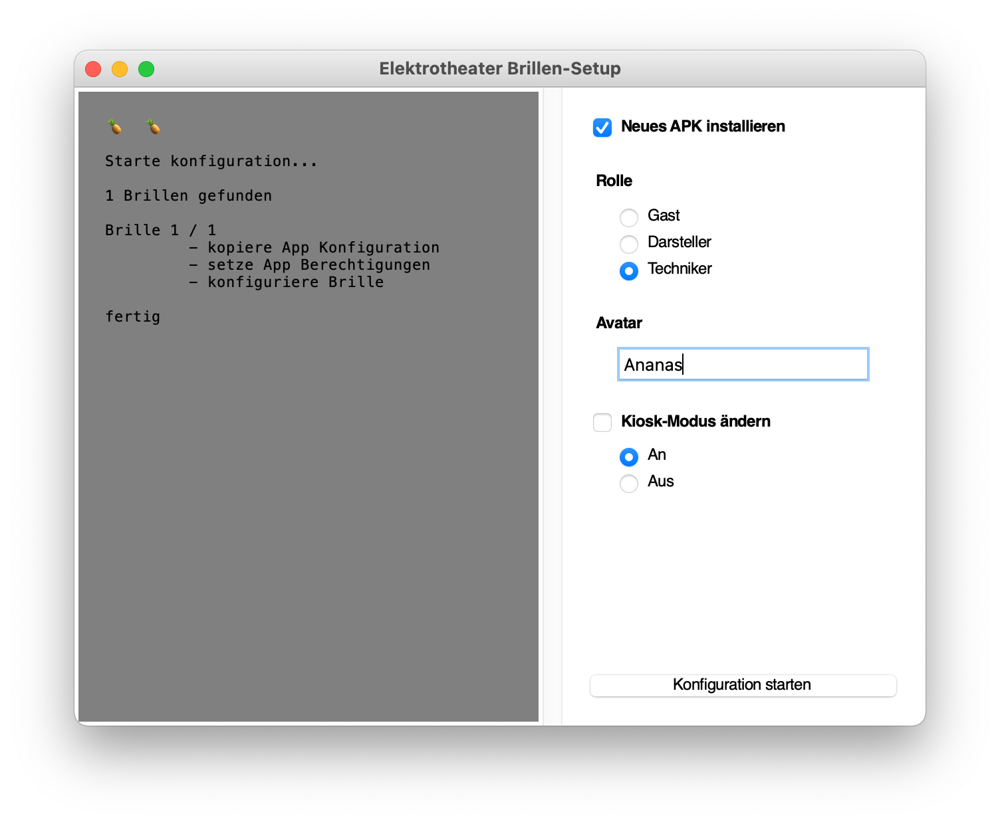

## Elektrotheater Helper Scripts

## Usage

### Automated Server deployment

Make a copy of the `.env.example` file for each server you want to deploy to and change all variables.

Run from command line

Linux/macOS

    ./venv/bin/python deploy-server.py -e <environment>

Windows

    .\venv\Scripts\python.exe deploy-server.py \e <environment>

### VR Device configuration tool

The setup tool will configure all Pico devices attached to the computer. This way bulk installation of multiple devices is automated and becomes less painful.

Linux/macOS

    ./venv/bin/python setup-devices.py

Windows

Double click the supplied _Brillen-Setup.bat_

#### Config files

The `data` folder contains several config files that are copied to the device.
Make changes in those files for customization.

## Development

### Create a Python environment and activate it

Linux/macOS

    python3 -m venv venv
    . venv/bin/activate

Windows

    py -m venv venv
    .\venv\Scripts\activate

### Update pip

Linux / macOS

    pip install --upgrade pip

Windows

    .\venv\Scripts\python.exe -m pip install --upgrade pip

### Install dependencies

    pip install python-dotenv
    pip install pysftp requests
    pip install -U pure-python-adb
    

### Get Android SDK platform tools

Download the native platform tools files from here from here:
https://developer.android.com/studio/releases/platform-tools#downloads

Now put the files in the folder for each platform, your are running the script on

    ── platform-tools
        ├─ darwin
        └─ win32

